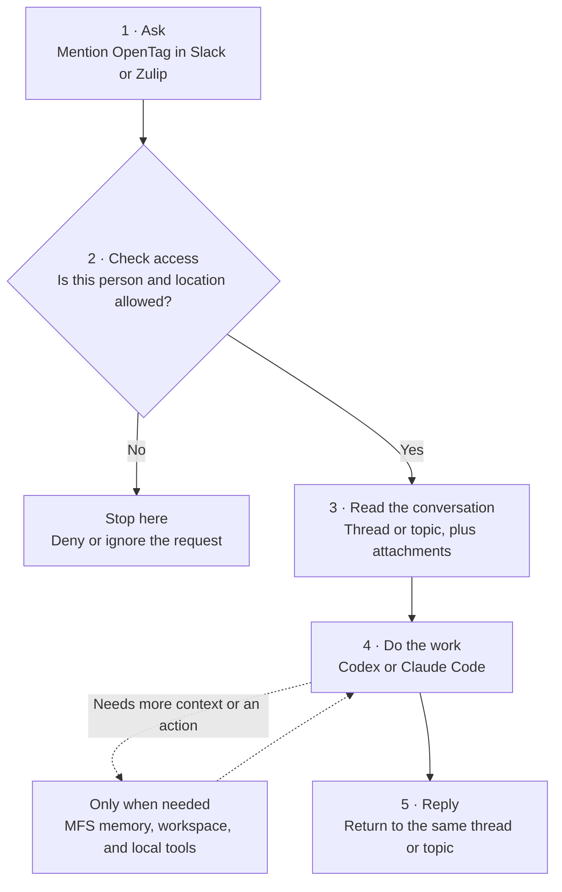
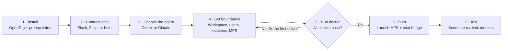
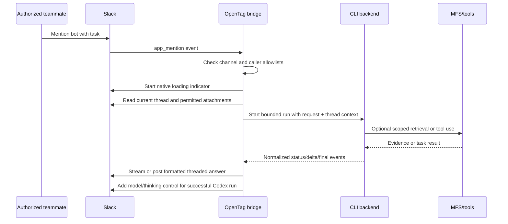
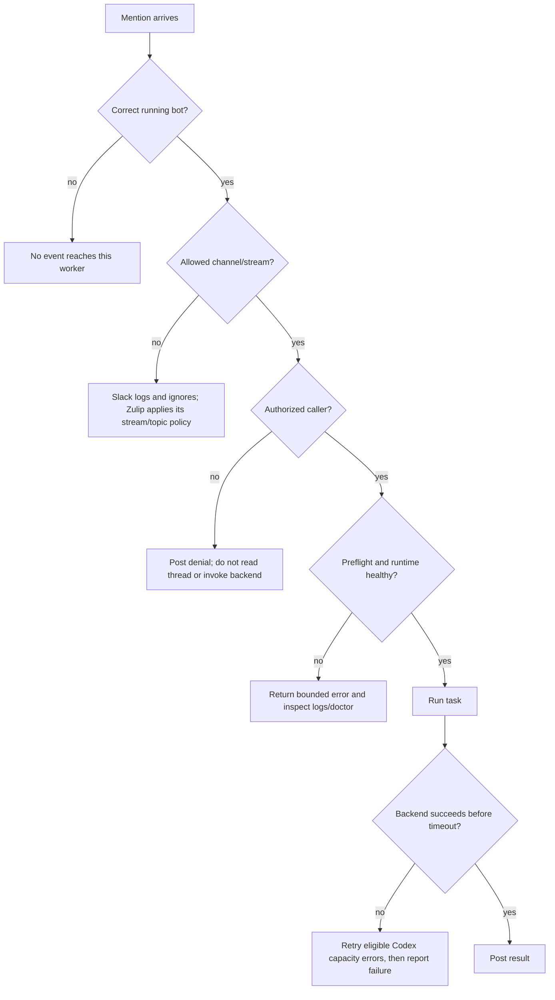

# How OpenTag works

This is a map of what happens after someone mentions OpenTag. Operators can use
it to set up or demo the bot. Contributors can use it to find where a feature
belongs. It also tells teammates what the bot can and cannot do today.

Examples use `@<bot-name>` because the Slack display name is configurable. A
mention must target the same Slack app whose tokens are used by the running
bridge.

## Product at a glance

OpenTag brings a locally authenticated Codex or Claude Code agent into a shared
Slack or Zulip conversation. The chat transport supplies the request and a
bounded slice of the conversation, the CLI backend performs the work, and MFS
supplies retrieval from sources approved by the operator. A working deployment
requires MFS and at least one allowed source, although any individual task may
finish without performing retrieval.

Read the solid line from top to bottom. The dashed branch is optional: simple
questions can go straight from the agent to the reply.

### Example: summarize a Slack thread

1. Maxine writes `@<bot-name> summarize this thread and list the open questions.`
2. OpenTag confirms that Maxine and the channel are allowed.
3. It reads up to 30 messages from the thread.
4. Codex or Claude writes the summary. It can search MFS if the request refers
   to older material outside the thread.
5. OpenTag posts the answer back in the same Slack thread.

### Example: continue a Zulip topic

1. A teammate mentions OpenTag in an allowed stream and topic.
2. OpenTag applies the configured stream and topic rules.
3. The agent receives that topic's context and works on the request.
4. With ZulipMCP, the topic session can listen for a follow-up until its idle
   timeout. The native adapter starts a fresh run for the next mention.
5. The answer stays in the same topic.

A few rules matter:

- **Chat** is the shared interface, not the source of model authentication.
- **Brain** is a fresh CLI run for each Slack mention unless the selected
  transport/backend explicitly provides session continuity.
- **Memory** setup is required for deployment. At runtime it contains only
  sources already indexed by MFS and allowed by `MFS_ALLOWED_SCOPES`; retrieval
  is used only when a request needs it.
- **Tools** are inherited from the local backend environment and keep their own
  credentials and authorization rules.

## Actors

| Actor | Responsibility |
|---|---|
| Workspace operator | Installs OpenTag, connects the chat app, chooses the backend and workspace, approves data scopes, and starts/stops the service. |
| Authorized teammate | Mentions the bot, supplies thread context or attachments, requests work, and reviews the shared result. |
| Unauthorized teammate | Receives a denial; their request does not read the thread or start the backend. |
| Slack or Zulip | Delivers the conversation and displays progress and results. |
| Codex or Claude Code | Reasons, retrieves context, uses permitted local tools, and performs workspace tasks. |
| MFS | Searches and reads previously indexed, operator-approved sources. |

## Connected lifecycle

Once this path works, normal use is much shorter: mention, work, reply. Return
to configuration and `doctor` only when you change the setup or diagnose a
failure.

## Flow 1: First-time setup

The first setup connects one chat identity to one local OpenTag worker. Start
with the smallest safe setup, test it, and add capabilities after that works.

1. The operator installs Python 3.10+, `uv`, MFS, and an authenticated Codex or
   Claude Code CLI.
2. The operator runs `./install.sh` or the guided setup launcher.
3. Setup records:
   - chat transport: `slack`, `zulip`, or `both`;
   - backend: `codex` or `claude`;
   - agent workspace;
   - bot display name;
   - allowed MFS roots;
   - timeout and retry policy.
4. For Slack, the operator creates/installs the app from the manifest, enables
   Socket Mode, supplies the `xapp-` and `xoxb-` tokens, and records at least one
   owner member ID in `SLACK_ALLOWED_USER_IDS`.
5. For Zulip, the operator supplies a Generic bot configuration and chooses the
   native or ZulipMCP engine.
6. The operator indexes at least one useful source in MFS and adds its exact root
   to `MFS_ALLOWED_SCOPES`.
7. `./tag doctor` verifies configuration, backend availability, MFS access, and
   chat access before the service starts.
8. `./tag start` launches MFS and the configured chat bridge or bridges.
9. `./tag status` and `./tag logs` provide the first operational check.

You know setup worked when the running service announces the same bot name that
Slack or Zulip resolves in a mention.

## Flow 2: Delegate a task from Slack

Try this:

> `@<bot-name> summarize this thread and list decisions, owners, and open questions.`

Runtime behavior:

- A top-level mention starts a new Slack thread; a mention inside an existing
  thread continues with that thread's context.
- The bridge strips the mention before sending the request to the backend.
- Slack's native loading indicator is used while work is in progress.
- Claude can stream answer text. Codex currently posts its complete final answer
  because the CLI event stream does not expose answer-token deltas.
- Long answers are split into readable threaded replies.
- Failures are returned in the same thread with a bounded error message.

## Flow 3: Continue work with thread context and attachments

For example:

> `@<bot-name> compare that proposal with the earlier recommendation.`

> `@<bot-name> review the attached screenshot and explain the failure.`

1. OpenTag fetches one Slack replies page containing up to 30 messages from the
   current thread rather than only the newest message. It does not currently
   paginate longer threads or separately guarantee that a triggering message
   beyond Slack's returned page is retained.
2. Plain message text, legacy attachment fields, and bounded text-file content
   are normalized into the prompt.
3. Image attachments are downloaded into a temporary invocation directory and
   exposed to the backend for inspection. Each downloaded file is limited to
   15 MB; a larger file is skipped with a retrieval-failure marker rather than
   truncated. Embedded text is limited to 12,000 characters per value/file.
   There is no separate aggregate attachment-byte limit beyond the single
   30-message page and per-file limit.
4. The backend resolves references such as “that”, “the previous answer”, or
   “use the screenshot” from the collected thread.
5. Temporary attachment files are removed when the invocation finishes. A
   failed download is represented in the prompt so the backend can explain what
   it could not inspect instead of silently inventing content.

Attachments are treated as untrusted input. Instructions embedded in an image
or document do not override the teammate's request or the runtime policy.

## Flow 4: Retrieve durable context through MFS

Thread history is short-term conversational context. MFS provides durable,
searchable context from approved sources.

For a cross-source task:

> `@<bot-name> find the original decision, compare it with the current code, and explain what changed.`

1. The backend decides that external context is needed.
2. It searches only roots listed in `MFS_ALLOWED_SCOPES`.
3. It reopens relevant hits when precise lines or records are needed.
4. It combines retrieved evidence with the current thread and workspace state.
5. It cites paths/records when requested or when provenance materially improves
   the answer.

Supported MFS source types can include Slack history, local files, GitHub, Jira,
Linear, databases, object stores, and other configured connectors. Indexing a
source and allowing its root are separate operator decisions; both are required.

For a channel summary:

> `@<bot-name> summarize this channel and identify unresolved action items.`

For a channel-level request, the backend looks up the current channel inside an
allowed indexed Slack source. It does not mistake the current thread for the
whole channel. If no matching indexed Slack source exists, it says that channel
history is unavailable.

## Flow 5: Perform workspace work

Try this:

> `@<bot-name> fix the failing parser test, run the focused suite, and summarize the changed files.`

1. The backend receives the configured working directory and runtime contract.
2. It inspects files, runs commands, or edits code with the local account's
   permissions.
3. It uses installed skills and commands when they match the task and are
   available to that backend process.
4. It runs proportionate verification.
5. It reports changed files and observed test/command results in Slack or Zulip.

OpenTag does not add a hardened sandbox. The operator should use a trusted
workspace for demos and an external sandbox for stronger production isolation.

## Flow 6: Create shared Slack outputs

The default result is a reply in the invoking Slack thread. Two explicit output
flows are also available:

### Post a top-level channel message

Try this:

> `@<bot-name> turn the agreed release notes into a short announcement and post it in this channel.`

When the request explicitly says to post, send, or share, the backend can call
the channel-post helper. The helper is restricted to the channel that invoked
OpenTag; the backend cannot select an arbitrary destination.

### Create a Slack Canvas

Try this:

> `@<bot-name> create a Canvas called “Launch Checklist” from the decisions in this thread.`

The backend writes Markdown in the configured workspace and calls the Canvas
helper. The helper creates a Canvas only in the invoking channel and enforces a
500 KB content limit.

## Flow 7: Change model and thinking for a Slack thread

After a successful Codex reply, an authorized teammate can select **Change model
& thinking**.

1. OpenTag opens a modal containing available Codex models and supported
   reasoning levels.
2. Operator allowlists restrict the choices when configured.
3. OpenTag validates and saves the selection for the current Slack thread.
4. An ephemeral confirmation tells the teammate that the choice applies to the
   next request.
5. Future mentions in that thread use the saved choice, including after bridge
   restarts.

Settings are thread-specific, so one conversation can use deeper reasoning
without changing every other conversation. Any authorized teammate in that
thread may update the shared thread setting. “Default” delegates model or
reasoning selection to the Codex CLI. If a saved choice is no longer available,
OpenTag normalizes it back to the applicable default. Claude replies do not
show this control.

## Flow 8: Use optional local tools and Google Workspace skills

OpenTag can use commands and skills already available to the selected CLI
backend. The included Google Workspace catalog demonstrates this pattern across
Gmail, Calendar, Drive, Docs, Sheets, Slides, Tasks, Chat, Meet, Forms,
Classroom, People, Keep, Events, Apps Script, Admin Reports, Model Armor, and
cross-service workflows.

Try this:

> `@<bot-name> find the next free 30-minute slot, create the meeting, and email the attendees.`

The backend selects the appropriate installed skills, and each tool enforces its
own authentication and grants. OpenTag does not silently grant Google Workspace
access or maintain a second per-tool permission system.

See [Included skills](skills.md) for the generated service, helper, persona, and
recipe catalog.

## Flow 9: Use Zulip

The same backend and MFS memory can be exposed through either Zulip engine:

| Engine | Conversation model | Best fit |
|---|---|---|
| Native | Fresh bounded run for every direct message or stream mention | Simple one-shot requests and operational parity with Slack. |
| ZulipMCP | Persistent mention-activated session per stream/topic | Follow-up-heavy topic conversations within configured session limits. |

The Zulip path applies stream/topic read and write policy, isolates Slack
credentials, and returns concise Zulip-ready answers. ZulipMCP sessions listen
for follow-ups until their configured idle timeout and then end cleanly.

## Flow 10: Denials, failures, and recovery

Recommended recovery order:

For a completely silent mention, debug event delivery first:

1. Confirm the mentioned Slack/Zulip identity matches the running worker.
2. Run `./tag status` and confirm the expected transport is running.
3. Confirm the bot is invited and has the required scopes/events.
4. Confirm the channel/stream policy allows that location.
5. Run `./tag logs` and look for a received, ignored, or rejected event.

If the event arrives but the task fails, debug runtime dependencies next:

1. Run `./tag doctor` and correct the first failed check.
2. Confirm the caller allowlist. An unauthorized Slack caller receives a
   threaded denial before OpenTag reads the thread or invokes the backend.
3. Inspect the transport/backend error in `./tag logs`.
4. For retrieval failures, confirm MFS is healthy and the requested source root
   is both indexed and allowed. MFS cannot cause Slack to omit the original
   mention event.
5. Restart only after configuration changes that require a new process.

## Flow 11: Operate, update, and remove OpenTag

| Operator intent | User flow |
|---|---|
| Check health | `./tag status` → `./tag doctor` → `./tag logs` when needed. |
| Start | Preflight succeeds → MFS starts → selected bridge or bridges start. |
| Stop | Slack/Zulip bridges stop → local MFS process stops. |
| Change configuration | Stop → edit private `.env`/rerun guided setup → doctor → start → realistic mention test. |
| Change Slack scopes/interactivity | Update manifest in Slack → reinstall app → refresh tokens if required → restart → mention test. |
| Upgrade | Stop → pull the intended release → rerun installer → doctor → start → smoke test. Existing private `.env` is preserved. |
| Uninstall | Stop → remove the clone; optionally remove MFS binaries/data separately. |

## A demo that covers the product

Use this 12-step script for a product demo. Run it in a sandbox workspace and an
isolated chat location. Skip an optional step when its dependency is not set up.

1. Show `./tag status`, `./tag doctor`, and the startup summary. Confirm that the
   displayed bot identity matches the mention.
2. Mention `@<bot-name>` and ask it to summarize a short discussion.
3. In that thread, reply with `@<bot-name> turn that into three next actions.`
   Every Slack invocation requires a mention.
4. Attach a supported screenshot or text file and mention `@<bot-name>` for an
   explanation grounded in the attachment. Use an image-capable backend/model
   for the screenshot path.
5. With an indexed and allowed MFS root, mention the bot and ask for a fact or
   decision stored there.
6. With an indexed and allowed Slack source, mention the bot and ask for a
   summary of that channel.
7. Request a small code or documentation change and focused verification in the
   sandbox workspace.
8. Explicitly request a top-level channel announcement. To demonstrate a Canvas
   instead, confirm the installed bot has the
   `canvases:write` scope; reinstall the app if that scope was newly added.
9. With the Codex backend, reinstall the updated manifest with Slack
   interactivity enabled. Change the model/reasoning choice, then invoke the next
   task in that thread.
10. If Google Workspace tools are authenticated, run one cross-service recipe
    such as meeting preparation or email-to-task.
11. If a separate non-allowlisted test account is available, mention the bot and
    show that the backend is not invoked.
12. If Zulip is configured, repeat a basic task in the native adapter. Then show
    a topic follow-up with ZulipMCP if that engine is enabled.

## Capability coverage and current boundaries

| Capability | Current path | Important condition or boundary |
|---|---|---|
| Slack mentions and threaded replies | Implemented | Mention must target the installed app used by the running tokens. |
| Caller authorization | Implemented | `SLACK_ALLOWED_USER_IDS` is required and fails closed. |
| Optional channel restriction | Implemented | Empty allows any joined channel; configured ID restricts execution. |
| Thread text and text attachments | Implemented | Content is bounded and treated as untrusted. |
| Image attachment understanding | Implemented bridge path | Images up to 15 MB are downloaded temporarily; successful interpretation still depends on the selected backend/model. |
| Generated-image upload to Slack | **Not implemented by the bridge** | A backend may generate a local image, but OpenTag currently has no dedicated upload-and-attach result path. |
| Slack loading state and answers | Implemented | Claude text can stream; Codex currently posts the complete final answer. |
| Long-answer splitting | Implemented | Results remain in the invoking thread. |
| Model/reasoning settings | Implemented for Codex | Requires Slack interactivity and a reinstalled updated manifest. |
| Top-level channel posts | Implemented on explicit request | Restricted to the invoking channel. |
| Slack Canvas creation | Implemented on explicit request | Restricted to the invoking channel; `canvases:write` required. |
| MFS search/read | Implemented | Source must be indexed and its root explicitly allowed. |
| Workspace commands and edits | Implemented through backend | Uses local account permissions; not a hardened sandbox. |
| Local skills/tools, including Google Workspace | Available when installed and authenticated | Each tool retains its own credentials and grants. |
| Slack durable session | Not provided | Each mention launches a fresh agent; thread text and MFS restore context. |
| Slack direct messages | Not implemented by the current manifest/handler | The bridge subscribes to channel `app_mention` events, not direct-message events. |
| Duplicate-event idempotency and cancellation | Not implemented | Avoid concurrent mentions in the same thread; tasks stop on timeout or process termination rather than a user cancellation control. |
| Side-effect confirmation layer | Not provided by OpenTag | Workspace and connected-tool actions follow the selected backend/tool's permissions and confirmation behavior. |
| Zulip native one-shot mode | Experimental | Fresh bounded run per DM/mention. |
| ZulipMCP persistent topic mode | Experimental | Controlled by stream/topic policy and session caps. |
| Enterprise governance/audit/approvals | Not provided | Add external sandboxing and policy systems for production use. |

## Related documentation

- [Slack setup and behavior](../references/slack-adapter.md)
- [Backend behavior](../references/backends.md)
- [Runtime agent contract](../references/runtime-agent.md)
- [Memory model](../references/memory.md)
- [ZulipMCP runtime](../references/zulipmcp-runtime.md)
- [Included skills](skills.md)
- [Troubleshooting](troubleshooting.md)
- [Security policy](../SECURITY.md)
